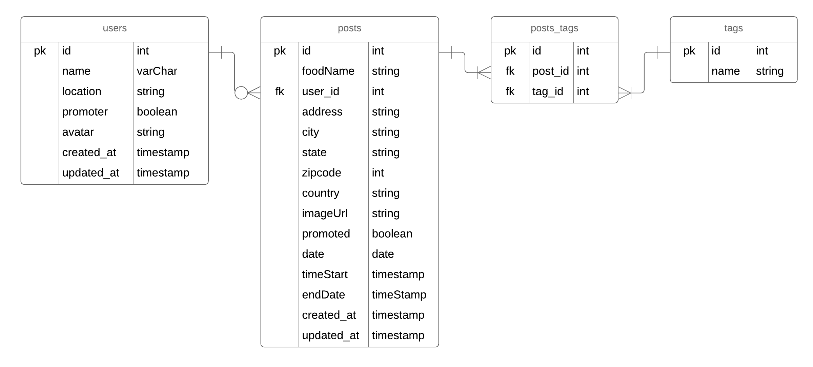
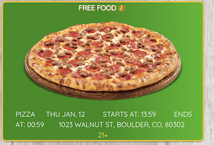

# Food Seen
Full stack application where users can sign in using OAuth(GitHub) to create posts about finding free food and where businesses can promote events under the guise of free food. 

# Installation
* npm install
* for local testing install psql db 'foodspot-dev'
* knex migrate:latest
* Check for a listening server with 'npm test' to run nodemon

# Working model ERD

# "Screen Shot"

